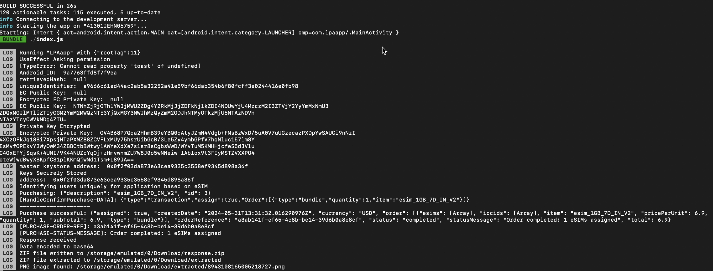

# eSIM Wallet

This project is the codebase for a eSIM-Wallet app developed to create eSIM based wallets which allow users to interact with blockchain.
Right now this app only works on android. iOS support is planned in the future.

## Project setup

The instructions provided below are for macOS. Detailed setup instructions for react-native projects along with dependencies for other operating systems can be found [here](https://reactnative.dev/docs/environment-setup?guide=native&platform=android)

### Node and JDK setup

This app is a react-native based app with java bridges to interface between android core API's and the react-native component.
Install node and watchman. Make sure to use Node 18 or higher version. Watchman, a tool by Facebook, allows watching changes in the filesystem. It is highly recommended to install it for better performance.

```sh
brew install node
brew install watchman
```

We recommend installing the OpenJDK distribution Azul Zulu.

```sh
brew tap homebrew/cask-versions
brew install --cask zulu17

# Get path to where cask was installed to double-click installer
brew info --cask zulu17
```

After installing the JDK, update the JAVA_HOME environment variable. Using above steps, JDK will likely be at `/Library/Java/JavaVirtualMachines/zulu-17.jdk/Contents/Home`

We recommend JDK 17 as higher JDK versions might cause some issues. To make sure JDK version 17 is used, update the `JAVA_HOME` and `PATH` variable to reflect the same.

```sh
export JAVA_HOME=/Library/Java/JavaVirtualMachines/zulu-17.jdk/Contents/Home/
export PATH=$JAVA_HOME/bin:$PATH
```

### Setup Android Studio

[Download and Install Android Studio](https://developer.android.com/studio/index.html)

While on Android Studio installation wizard, make sure the boxes next to all of the following items are checked:

- Android SDK
- Android SDK Platform
- Android Virtual Device

Then, click "Next" to install all of these components.

Android Studio installs the latest Android SDK by default. Building a React Native app with native code, however, requires the `Android 14 (UpsideDownCake)` SDK in particular. Additional Android SDKs can be installed through the SDK Manager in Android Studio.

To do that, open Android Studio, click on "More Actions" button and select "SDK Manager".

Select the "SDK Platforms" tab from within the SDK Manager, then check the box next to "Show Package Details" in the bottom right corner. Look for and expand the `Android 14 (UpsideDownCake)` entry, then make sure the following items are checked:

- Android SDK Platform
- `Intel x86 Atom_64 System Image` or `Google APIs Intel x86 Atom System Image` or (for Apple M1 Silicon) `Google APIs ARM 64 v8a System Image`

Setup environment variables to use the android utlities just installed. Add the following lines in `~/.zshrc` or `~/.zprofile` (or `~/.bashrc` file if using bash shell)

```sh
export ANDROID_HOME=$HOME/Library/Android/sdk
export PATH=$PATH:$ANDROID_HOME/emulator
export PATH=$PATH:$ANDROID_HOME/platform-tools
```

then run

```sh
source ~/.zshrc
```

Verify that `ANDROID_HOME` has been set by running `echo $ANDROID_HOME` and the appropriate directories have been added to your path by running `echo $PATH`.

> Please make sure that the correct Android SDK path is set. To find the actual location of the SDK in the Android Studio click on "Settings" dialog, under Languages & Frameworks → Android SDK.

### Clone the project

```sh
https://github.com/Blockchain-Powered-eSIM/eSIM-Wallet.git
```

This project uses React Native's built-in command line interface. Rather than install and manage a specific version of the CLI globally, we recommend accessing the current version at runtime using `npx`, which ships with Node.js. With `npx react-native <command>`, the current stable version of the CLI will be downloaded and executed when the command is run.

> Please remove any globally installed react-native-cli package previously as it may cause unexpected issues
>
> ```sh
> npm uninstall -g react-native-cli @react-native-community/cli
> ```

An Android device or an Android Virtual Device (AVD) setup is required to run the app.

To use a physical android device. just connect it to you computer and enable USB debugging. More details are available [here](https://reactnative.dev/docs/running-on-device)

To use an AVD for development and testing, create one using Android Studio Device Manager.

Open `./eSIM-Wallet/android`, to see the list of available Android Virtual Devices (AVDs) open "AVD Manager" in Android Studio. If no virtual device available, create a new one by following the instructions [here](https://developer.android.com/studio/run/managing-avds.html). Preferred image for testing is `UpsideDownCake API Level 34`. **Make sure that the Android version on your virtual device is greater than Android 10 (or API level 30)**

The project uses some react native libraries as dependencies. Run the follwing command (from the project working directory) to make sure all required libraries are installed before your first build.

```sh
npm install
```

## Running the project

After successful installation of packages and dependencies,
Start the project by running the below command:

```sh
npm run start
```

and then press `a` to run on Android

#### Expected output:



[](https://www.youtube.com/watch?v=CF9fWZBnfUc)

[](https://www.youtube.com/watch?v=P9Hwydr5FeU)

## Test Environment

The deployed code is tested on macOS 14.1.1 for Android OS,  
node version 19.5.0, JDK version 17.0.1, openjdk 17.0.10 and
OpenJDK Runtime Environment Zulu17.48+15-CA (build 17.0.10+7-LTS)

Refer to [package.json](https://github.com/Blockchain-Powered-eSIM/eSIM-Wallet/blob/main/package.json) for more details on versions of tools used for development and testing.

**Minimum API Level required is 29**

Setup and execution instructions using Detox for end-to-end (E2E) testing and Jest for unit testing is laid out [here](https://github.com/Blockchain-Powered-eSIM/eSIM-Wallet/blob/main/e2e/README.md).

## Android Native Modules

### [DeviceInfoBridge](https://github.com/Blockchain-Powered-eSIM/eSIM-Wallet/blob/main/android/app/src/main/java/com/lpaapp/DeviceInfoBridge/README.md)

The 'DeviceInfoBridge' provides functionality to React Native applications to interact with SIM card data on Android devices. It allows the retrieval of SIM card information, eSIM support checks, and eSIM setup functionalities (given relevant permissions are given to the application).

### [ECKeyManager](https://github.com/Blockchain-Powered-eSIM/eSIM-Wallet/blob/main/android/app/src/main/java/com/lpaapp/ECKeyManager/README.md)

This native module exposes java functions and react methods that deal with the generation and management of ECDSA keys. To generate Ethereum keys, the native module uses `Web3j` and `BouncyCastle` libraries. The EC key pair is generated using the `secp256k1` EC.

### [EuiccBridge](https://github.com/Blockchain-Powered-eSIM/eSIM-Wallet/blob/main/android/app/src/main/java/com/lpaapp/EuiccBridge/README.md)

The `EuiccBridge` provides an interface for React Native applications to interact with the embedded Universal Integrated Circuit Card (eUICC).

### [IdentityManager](https://github.com/Blockchain-Powered-eSIM/eSIM-Wallet/blob/main/android/app/src/main/java/com/lpaapp/IdentityManager/README.md)

The `IdentityManager` provides functionalities to React Native applications to interact with device and subscriber identity information on Android devices. It allows the retrieval of phone numbers for the default SIM, screen resolution, and generates a unique identifier using secure hashing mechanisms.

### [KeyStoreBridge](https://github.com/Blockchain-Powered-eSIM/eSIM-Wallet/blob/main/android/app/src/main/java/com/lpaapp/KeyStoreBridge/README.md)

The `KeyStoreBridge` provides secure key management (`RSA` and `ECDSA`) functionalities within a React Native application, leveraging Android's native KeyStore system to generate, store, and manage cryptographic keys and certificates. This module is specifically tailored for Android devices and offers methods to securely handle encryption keys and perform encryption/decryption operations.
